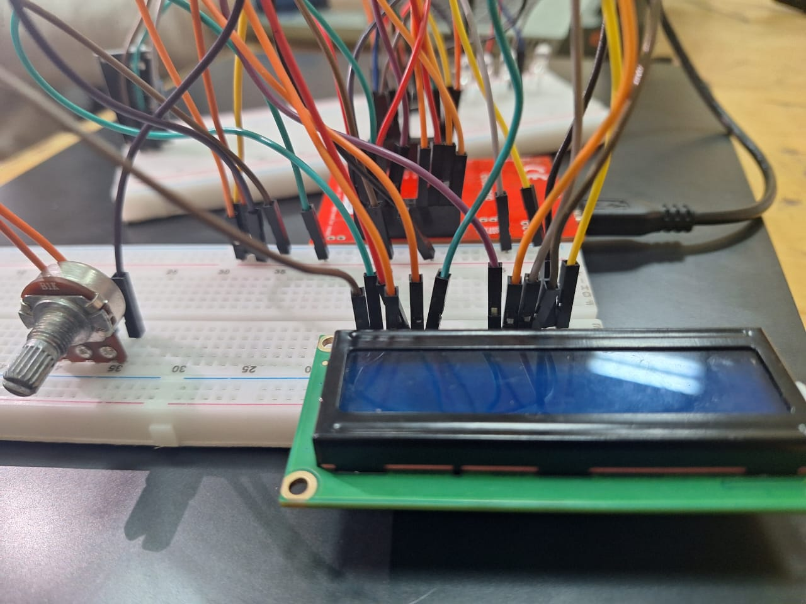
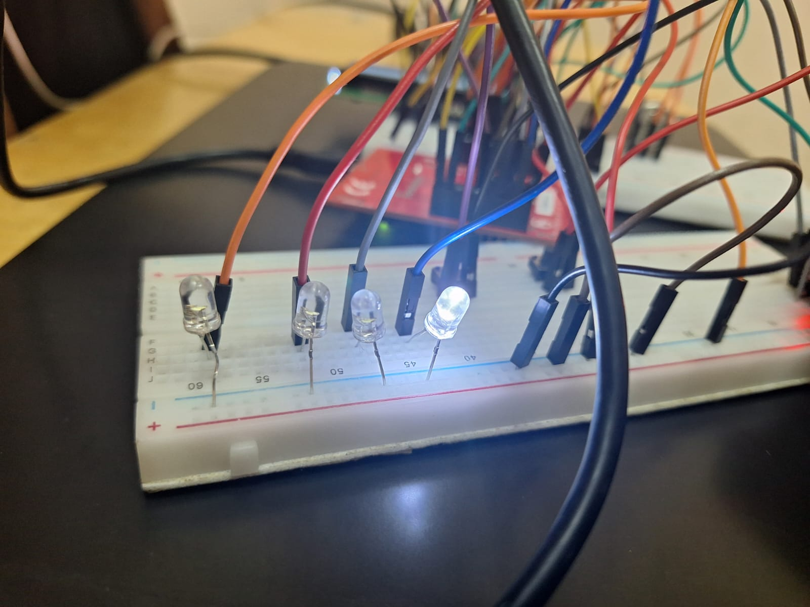
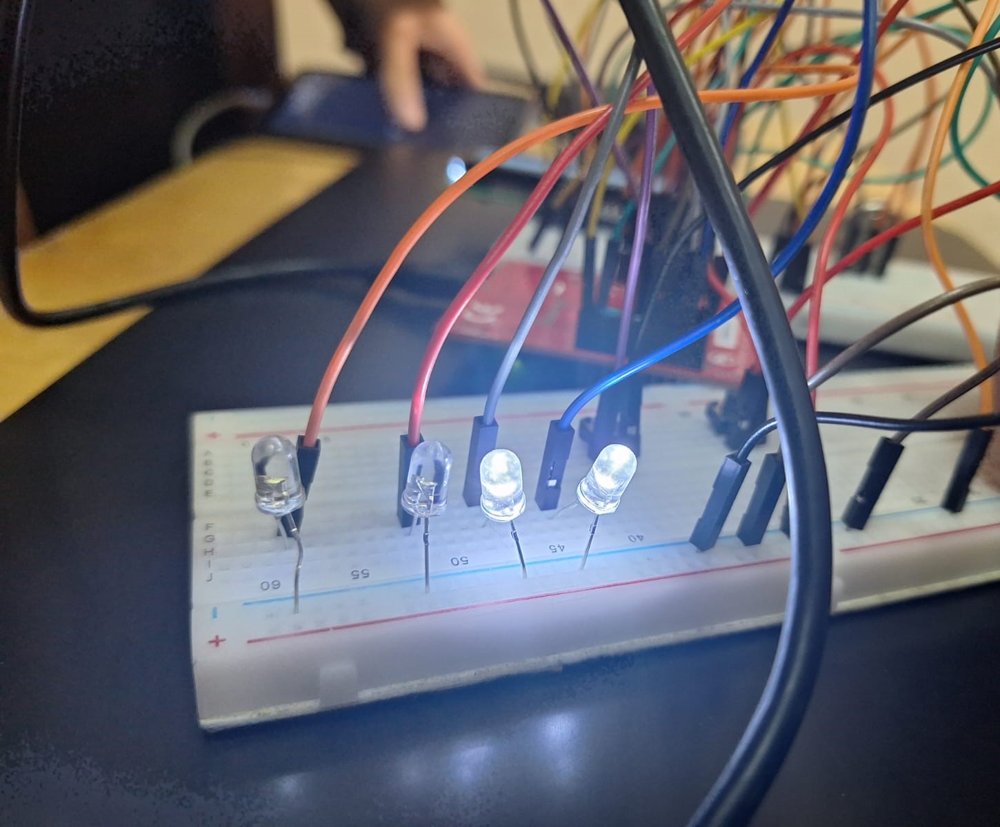

# Smart Reactive Audio-Visual System

This project involves designing and implementing a **Smart Reactive Audio-Visual System** using the **Tiva C microcontroller**. The system integrates various hardware peripherals and communication protocols to provide real-time audio and visual feedback. Specifically, the system controls an **LED light strip** that reacts dynamically to sound intensity while also displaying relevant information on an **LCD screen**. Two switches allow the user to control the operation of the LED light strip and the LCD.

  
  
  
  

## Features
- Real-time audio-visual feedback system.
- **LED light strip** reacts to sound intensity captured via the ADC.
- User control through two switches:
  - **Switch 1**: Toggles the LED light strip.
  - **Switch 2**: Toggles the LCD display.
- LCD displays real-time sound intensity values.
- Efficient use of **interrupts** and **timers** to manage tasks.
- Integration of **UART** for debugging and communication.

---

## Hardware Components
1. **Tiva C Microcontroller (TM4C123G)**
2. **LED Light Strip**
3. **Microphone/Audio Sensor**
4. **16x2 LCD Display**
5. **Push Button Switches (x2)**
6. Resistors, Capacitors, and other passive components
7. Breadboard and jumper wires

---

## Software Components
- **Timer Modules** for precise task scheduling.
- **ADC (Analog-to-Digital Converter)** to process sound intensity input.
- **GPIO** for controlling LEDs and reading switch states.
- **Interrupts** for handling button presses and real-time ADC processing.
- **UART** for debugging and serial communication.
- **LCD Library** for displaying information.

---

## System Overview

  
  

---
## Functional Description
### 1. **Sound Intensity Measurement**
- The microphone/audio sensor converts sound intensity into an analog signal.
- The **ADC** of the Tiva C reads this analog signal and converts it to a digital value.

### 2. **LED Light Strip Control**
- The LED light strip reacts to the digital value of the sound intensity.
- LEDs light up dynamically based on the sound intensity, creating a visual representation of the sound.

### 3. **LCD Display**
- The LCD displays the current sound intensity value in real-time.
- The user can toggle the LCD display on/off using **Switch 2**.

### 4. **Switch Controls**
- **Switch 1**: Enables or disables the LED light strip.
- **Switch 2**: Enables or disables the LCD display.
- Switches are connected to GPIO pins and handled using **interrupts** for real-time responsiveness.

---

## Peripherals and Features Used

### 1. **Timer**
- Timers are used to manage periodic tasks such as reading ADC values and updating the LED light strip.

### 2. **Interrupts**
- Interrupts are used to handle switch presses and ADC conversions efficiently.
- Edge-triggered interrupts are configured for the GPIO pins connected to the switches.

### 3. **ADC (Analog-to-Digital Converter)**
- Configured to read analog signals from the microphone/audio sensor.
- Provides digital values proportional to the sound intensity.

### 4. **LED Light Strip**
- Controlled via GPIO pins.
- Reacts to the sound intensity by lighting up LEDs dynamically.

### 5. **Switches**
- Two switches connected to GPIO pins are used for user input.
- Switch states are monitored using GPIO interrupts.

### 6. **LCD**
- A 16x2 LCD display is used to show sound intensity values.
- Communication with the LCD is achieved using GPIO.

### 7. **GPIO**
- Used for controlling the LED light strip and interfacing with the switches and LCD.

---

## System Workflow
1. The system initializes all peripherals (ADC, GPIO, UART, Timer, Interrupts, and LCD).
2. The ADC continuously samples the sound intensity from the microphone/audio sensor.
3. Timer interrupts trigger periodic updates to the LED light strip and LCD.
4. Switch presses are handled via GPIO interrupts:
   - **Switch 1** toggles the LED light strip.
   - **Switch 2** toggles the LCD display.
5. UART outputs sound intensity values and system status for debugging.

---

## Development Environment
- **IDE**: KEIL
- **Programming Language**: C
- **Hardware Drivers**: TivaWare Peripheral Driver Library

---

## Usage
1. Power on the system.
2. Use **Switch 1** to toggle the LED light strip.
3. Use **Switch 2** to toggle the LCD display.
4. Observe the LED strip reacting to sound intensity and the LCD displaying real-time values.
5. Connect a UART terminal to monitor debug information.

---

## Conclusion
This project demonstrates the integration of multiple hardware peripherals on the Tiva C microcontroller to create a responsive and interactive audio-visual system. The use of timers, interrupts, and communication protocols ensures real-time performance and efficient resource utilization.

